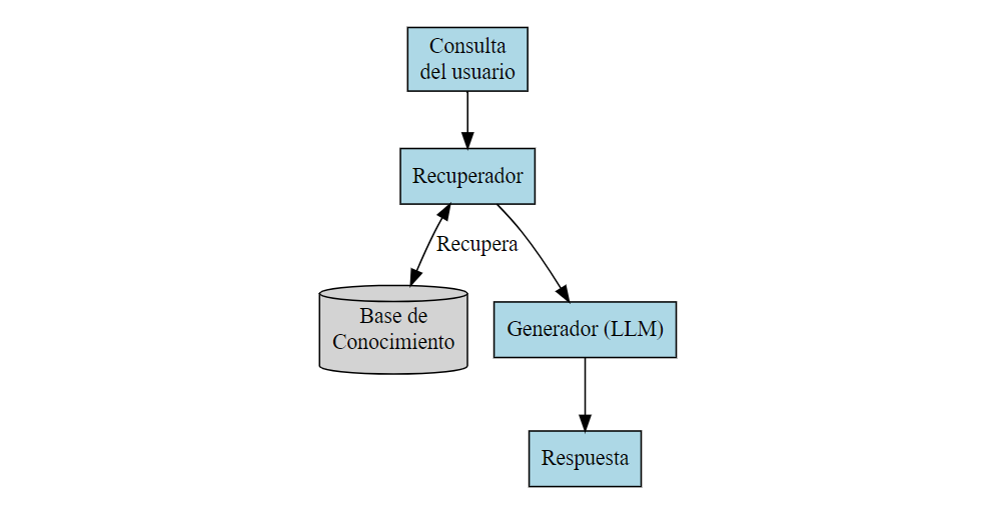

## Quien soy

- Economista con máster en economía cuantitativa y en data science
- Doctorando en Finanzas y Economía Cuantitativas (UCLM-UCM)
- Docente universitario por más de 18 años 
- Consultor independiente de ciencia de datos en el JRC Sevilla
- Vocal de la asociación Comunidad R Hispano

## Motivación

### Dos Vertientes

-   **Limitaciones en Cursos Actuales:**
    -   Los cursos de política económica no dan suficiente espacio a la política medioambiental.

    -   La relevancia de la política ambiental: El 20% del presupuesto de la UE se destina a la lucha contra el cambio climático. [(Fuente)](https://climate.ec.europa.eu/eu-action/eu-funding-climate-action)

    -   Efectos directos en ciudadanía: calidad ambiental, movilidad, consumo y reorganización industrial.

## Motivación

### Dos Vertientes

-   **Análisis Cuantitativo**
    -   Falta de análisis cuantitativo adecuado en las asignatura de política económica.
    -   Necesidad de un enfoque cuantitativo más robusto en la política medioambiental.
    -   Enfoque en la estimación cuantitativa de efectos a nivel práctico y de análisis.

------------------------------------------------------------------------

## Proyecto

-   **Objetivo del Proyecto:**
    -   Diseñar un módulo de curso de política económica que incluya la política medioambiental y un análisis cuantitativo de la misma.

------------------------------------------------------------------------

## Metodología

### Enfoque Propuesto

-   Uso de matrices input-output multi país con extensiones medioambientales.
-   Ejercicios prácticos usando el lenguajes de programación R.

------------------------------------------------------------------------

<!-- ## Metodología -->

<!-- ### Criterios de Diseño -->

<!-- -   **Simplicidad:** -->
<!--     -   Accesible para estudiantes de grado. -->
<!--     -   Basado en contabilidad nacional y álgebra lineal básica. -->
<!-- -   **Interpretabilidad:** -->
<!--     -   La linealidad del modelo input-output facilita la interpretación de resultados. -->

<!-- ------------------------------------------------------------------------ -->

<!-- ## Metodología -->

<!-- ### Criterios de Diseño -->

<!-- -   **Resultados Cuantitativos:** -->
<!--     -   Permite estimar el impacto de políticas medioambientales a nivel agregado y sectorial. -->

<!-- ------------------------------------------------------------------------ -->

## Herramientas Propuestas

-   **R:**
    -   Transversalidad en cursos de economía: econometría, estadística, finanzas, etc.
    -   Alta empleabilidad en ciencia de datos y consultoría económica.
    -   Software libre, sin coste para estudiantes y universidades.

------------------------------------------------------------------------

## Objetivos

-   Diseñar un módulo/taller que contemple la política medioambiental con un enfoque cuantitativo.
-   Desarrollar herramientas de apoyo:
    -   Notas de clase en formato Quarto y webR.
    -   Librería de R para el cálculo de la huella de carbono con datos reales.
    -   Cuestionarios interactivos con soporte de modelos grandes de lenguaje (LLM) usando Ellmer y Ragnar.
    -   Ejercicios de creación de skills para asistentes de codificación de IA agéntica (Claude code, Cursor, opencode)

------------------------------------------------------------------------

## Estado del Proyecto

-   **Herramientas Desarrolladas:**
    -   Borrador inicial de notas de clase en Quarto y webR.
    -   Primera versión de la librería de R.
    -   Primera versión de un chatbot elaborado usando RAG con las librerías Ellmer y Ragnar
    -   Ejemplo de elaboración de skills probado con [opencode](https://opencode.ai/)
-   **Herramientas por Desarrollar:**
    -   Simulador interactivo con Shiny.
    -   Repositorio con “plantillas” de las herramientas para uso de terceros.

------------------------------------------------------------------------

## Antes de continuar

**El objetivo de este proyecto no es presentar herramientas de frontera, sino introducir herramientas que cualquier docente con un conocimiento intermedio del lenguaje R, pueda implementar con un esfuerzo razonable.**

<!-- -   **Limitaciones Actuales:** -->
<!--     -   El módulo aún no ha sido probado en un entorno de aula real. -->
<!--     -   La librería de R está en una fase inicial de desarrollo y requiere validación adicional. -->
<!--     -   El chatbot RAG es un prototipo y necesita mejoras en la interacción y precisión. -->


------------------------------------------------------------------------

## Notas de clase (R - FIGARO) 

::: r-fit-text
[**Notas**](https://r-trainings.quarto.pub/propuesta-politica-medioambiente/)
:::

------------------------------------------------------------------------

## Librería de R {background-image="jde25.jpg"}


<iframe width="1200" height="700" src="https://www.youtube.com/embed/bjN_VvyUPic?si=9iYwZ7UPP0qI07U3" title="YouTube video player" frameborder="0" allow="accelerometer; autoplay; clipboard-write; encrypted-media; gyroscope; picture-in-picture; web-share" referrerpolicy="strict-origin-when-cross-origin" allowfullscreen></iframe>

<!-- <iframe src="https://pruebasaluuclm-my.sharepoint.com/personal/kamalantonio_romero_alu_uclm_es/_layouts/15/embed.aspx?UniqueId=db74cdcd-2458-446d-b3f4-4e79180ff33e&amp;embed=%7B%22ust%22%3Atrue%2C%22hv%22%3A%22CopyEmbedCode%22%7D&amp;referrer=StreamWebApp&amp;referrerScenario=EmbedDialog.Create" width="1280" height="720" frameborder="0" scrolling="no" allowfullscreen title="Grabando-20251102_194018.webm"> -->

<!-- </iframe> -->

------------------------------------------------------------------------

## Chatbot generado con RAG

Un flujo de trabajo básico de RAG generalmente combina estos pasos:

1.  Consulta del usuario – Un usuario proporciona una pregunta en lenguaje natural.
2.  Recuperador – El sistema recupera documentos o fragmentos relevantes de una base de conocimiento.
3.  Generador (LLM) – El modelo de lenguaje lee tanto la consulta del usuario como el contexto recuperado para generar una respuesta.

------------------------------------------------------------------------

## Componentes clave

-   **Consulta del usuario**: Un usuario proporciona una pregunta en lenguaje natural.
-   **Recuperador:** Recupera fragmentos de texto relevantes de la base de conocimiento (usando búsqueda de similitud en embeddings)
-   **Generador:** El LLM usa la consulta y los datos recuperados para formular una respuesta.

------------------------------------------------------------------------

## Flujo



[Apéndice: Implementación de RAG con Ragnar y Ellmer]

## Chatobot generado con RAG {background-image="jde25.jpg"}


<iframe width="1200" height="700" src="https://www.youtube.com/embed/QoSCzM7AxiY?si=RWWZsQV-M_HZ7ZFP" title="YouTube video player" frameborder="0" allow="accelerometer; autoplay; clipboard-write; encrypted-media; gyroscope; picture-in-picture; web-share" referrerpolicy="strict-origin-when-cross-origin" allowfullscreen></iframe>


<!-- <iframe src="https://pruebasaluuclm-my.sharepoint.com/personal/kamalantonio_romero_alu_uclm_es/_layouts/15/embed.aspx?UniqueId=1af10033-b153-450d-af75-693c25c6dda0&amp;embed=%7B%22ust%22%3Atrue%2C%22hv%22%3A%22CopyEmbedCode%22%7D&amp;referrer=StreamWebApp&amp;referrerScenario=EmbedDialog.Create" width="1280" height="720" frameborder="0" scrolling="no" allowfullscreen title="Grabando-20251102_203150.webm"> -->

<!-- </iframe> -->

------------------------------------------------------------------------

## Skills para flujos agénticos

En los últimos meses se ha escrito/dicho mucho acerca del uso de herramientas como Claude Code (Cursor, Antigravity) en economía (Antonio Mele, Scott Cunningham, Aniket Panjwani, Ben Golub...)

_Claude Code es una herramienta de codificación agéntica que lee tu base de código, edita archivos, ejecuta comandos e integra con tus herramientas de desarrollo._

_(...) es un asistente de codificación impulsado por IA que te ayuda a construir características, corregir errores y automatizar tareas de desarrollo. Entiende tu base de código completa y puede trabajar en múltiples archivos y herramientas para lograr las cosas._

Fuente : [Claude Code](https://code.claude.com/docs/es/overview)

------------------------------------------------------------------------

## Skills para flujos agénticos

### ¿Qué son skills?

_Son conjuntos de instrucciones reutilizables que enseñan a los agentes de IA cómo realizar tareas específicas. Piensa en ellas como «paquetes de conocimientos expertos» que puedes incorporar a tu agente._

_Sin skills debes explicar cada detalle cada vez: "Utiliza el paquete reghdfe de Stata con errores estándar agrupados, formatea la salida como LaTeX, sigue las directrices de estilo de AER..."._

Fuente : [Antonio Mele](https://meleantonio.github.io/awesome-econ-ai-stuff/)

_Un skill es una receta_  

Fuente : [Scott Cunningham](https://causalinf.substack.com/p/claude-code-part-13-skills-and-the)

------------------------------------------------------------------------

## Skills para flujos agénticos

### Ejemplo de skill

[Econometría con R](https://meleantonio.github.io/awesome-econ-ai-stuff/skills/analysis/r-econometrics/index/)

[Descarga, divide y lee en profundidad artículos académicos](https://github.com/scunning1975/MixtapeTools/blob/main/.claude/skills/split-pdf/SKILL.md)

------------------------------------------------------------------------

## Skills para flujos agénticos

### Actividad docente: Creación de skills

-   **Objetivo:** Crear un skill para un agente de IA que pueda realizar una tarea específica relacionada con la política medioambiental cuantitativa.


------------------------------------------------------------------------

## Skills para flujos agénticos

### Actividad docente: Creación de skills

¿Por qué crear skills?

- Al ser un conjunto de instrucciones ordenado cuyo resultado se ve plasmado en un objecto concreto (código), permite evaluar si los estudiantes son capaces de estructurar un conocimiento.
- Promueve la creatividad y el pensamiento sistemático en la aplicación de la IA.
- Permite a los estudiantes interactuar con agentes de IA de manera más efectiva.
- Una desventaja es que tiende a mecanizar el conocimiento

------------------------------------------------------------------------

## Skills para flujos agénticos

### Actividad docente: Creación de skills

<iframe width="1000" height="600" src="https://www.youtube.com/embed/UuzynshGVj0?si=ZIkqQ7NCVGtD54Vs" title="YouTube video player" frameborder="0" allow="accelerometer; autoplay; clipboard-write; encrypted-media; gyroscope; picture-in-picture; web-share" referrerpolicy="strict-origin-when-cross-origin" allowfullscreen></iframe>


<!-- <iframe src="https://eceuropaeu-my.sharepoint.com/personal/kamal_romero-sookoo_ext_ec_europa_eu/_layouts/15/embed.aspx?UniqueId=6654a591-7de5-4e90-92cc-b37e8b2ef4d0&embed=%7B%22ust%22%3Atrue%2C%22hv%22%3A%22CopyEmbedCode%22%7D&referrer=StreamWebApp&referrerScenario=EmbedDialog.Create" width="1280" height="720" frameborder="0" scrolling="no" allowfullscreen title="Recording-20260305_193356.webm"></iframe> -->


------------------------------------------------------------------------

## Skills para flujos agénticos

### Actividad docente: Creación de skills

[Skill](https://github.com/kamecon/IntroToR/blob/master/courseB7/io_multiplier_student.md)

[Código generado](https://github.com/kamecon/IntroToR/blob/master/courseB7/jornadas_docencia_ALDE.R)

------------------------------------------------------------------------

## Apéndice: Implementación de RAG con Ragnar y Ellmer

Crear repositorio de documentos y definir el modelo de embeddings

```{r}

store_location <- "test.ragnar.duckdb"

store <- ragnar_store_create(
  store_location,
  embed = \(x) embed_openai(x, model = "text-embedding-3-small")
)
```

Poblar el repositorio con documentos (embeddings a partir de pdfs en este caso)

```{r}

documentFile <- list.files(pattern = ".pdf")

for (file in documentFile) {
  chunks <- file |> read_as_markdown() |> markdown_chunk()
  ragnar_store_insert(store, chunks)
}

ragnar_store_build_index(store)

store2 <- ragnar_store_connect(store_location, read_only = TRUE)

```

## Apéndice: Implementación de RAG con Ragnar y Ellmer

Crear el cliente con un prompt y definir el modelo LLM

```{r}

client2 <- chat_openai(model = "gpt-4.1", 
                       params = ellmer::params(temperature = 0.2))
client2$set_system_prompt(glue::trim(
  "
You're a teacher that want students to learn about the environmental input output matrices.
You always respond only quoting material from the knowledge store
Before you start, ask the user a questions with a intermediate difficulty level and ask the user to answer them via multiple choice.
Format your responses with markdown.
After the user answers, provide feedback and then move on to the next question according to  if the answer is wrong (next question is easier) or correct (next question is more difficult).
You will be questioned in Spanish, you should answer in Spanish
  "
))

# Empieza la conversación
initial_bot_message <- client2$chat("Begin", echo = TRUE) 

```
